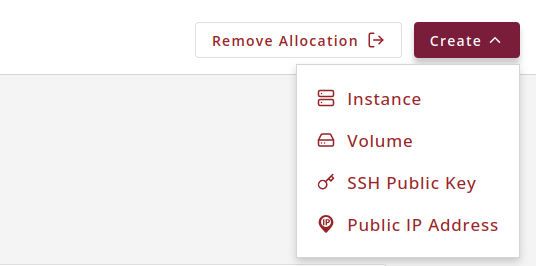

# Running Analyses on Jetstream2 with Planemo and Accessing the GenomeArk Bucket

## Introduction

This guide walks you through running analyses on Jetstream2 and accessing the GenomeArk bucket. You can launch either a preconfigured instance or a clean instance that you configure yourself. We'll focus on using [Planemo](https://planemo.readthedocs.io/en/latest/), a command-line tool for working with [Galaxy](https://galaxyproject.org/) workflows. Planemo can run workflows locally or on a Galaxy instance.

### Overview

1. [Configure access](https://docs.jetstream-cloud.org/ui/exo/access-instance/?h=) via SSH or passphrases
2. [Create a Jetstream2 instance](https://docs.jetstream-cloud.org/ui/exo/create_instance/)
3. [Create and mount a workspace volume](https://docs.jetstream-cloud.org/ui/exo/storage/)
4. Run Planemo
5. FAQ

---

## 1. Configure Access: SSH or Passphrases

Follow [this guide](https://docs.jetstream-cloud.org/ui/exo/access-instance/?h=) to access your Jetstream2 instance. We recommend setting up SSH keys, which can be easily done via Exosphere:

1. Go to Exosphere
2. Click **Create** → **SSH Public Key**



---

## 2. Create an Instance

Refer to the [Exosphere documentation](https://docs.jetstream-cloud.org/ui/exo/create_instance/) for creating a new instance.

### Steps:

1. Click **Create** → **Instance**
2. Select your image:

   * **By Type**: Create a clean instance (recommended: Ubuntu)
   * **By Image**: Use `Planemo-V0-75-30-20250522`
3. Configure your instance:

   * **Flavor**: `m3.large`
   * **SSH Key**: Select your previously uploaded key

> If you choose a clean instance, you’ll need to manually configure it: install dependencies, mount the GenomeArk bucket, and install Planemo.

### 2.1 Install Dependencies

```bash
sudo apt-get install -y \
   autoconf automake cryptsetup fuse2fs git fuse libfuse-dev \
   libseccomp-dev libtool pkg-config runc squashfs-tools \
   squashfs-tools-ng uidmap wget zlib1g-dev libsubid-dev \
   python3-lib2to3 s3fs btop
```

### 2.2 Mount the GenomeArk Bucket

Create the service file:

```bash
sudo tee /etc/systemd/system/mount-genomeark-js2.service > /dev/null <<EOF
[Unit]
Description=Mount genomeark S3 bucket using s3fs
After=network-online.target
Wants=network-online.target

[Service]
Type=oneshot
ExecStart=/usr/bin/s3fs genomeark /genomeark-js2 -o url=https://js2.jetstream-cloud.org:8001 \
    -o use_path_request_style -o allow_other -o public_bucket=1 -o uid=1001 -o gid=1001
RemainAfterExit=true

[Install]
WantedBy=multi-user.target
EOF
```

Mount the bucket:

```bash
sudo mkdir /genomeark-js2
sudo systemctl daemon-reexec
sudo systemctl enable mount-genomeark-js2.service
sudo systemctl start mount-genomeark-js2.service
```

### 2.3 Install Singularity

Install Go (required to build Singularity):

```bash
export VERSION=1.24.1 OS=linux ARCH=amd64
wget https://dl.google.com/go/go$VERSION.$OS-$ARCH.tar.gz
sudo tar -C /usr/local -xzf go$VERSION.$OS-$ARCH.tar.gz
rm go$VERSION.$OS-$ARCH.tar.gz

echo 'export PATH=/usr/local/go/bin:$PATH' >> ~/.bashrc
source ~/.bashrc
```

Install Singularity:

```bash
export VERSION=4.3.0
wget https://github.com/sylabs/singularity/releases/download/v${VERSION}/singularity-ce-${VERSION}.tar.gz

# Extract and build
 tar -xzf singularity-ce-${VERSION}.tar.gz
cd singularity-ce-${VERSION}
./mconfig
make -C builddir
sudo make -C builddir install
cd ..
rm -r singularity-ce-${VERSION}*
```

[Full guide](https://docs.sylabs.io/guides/latest/user-guide/quick_start.html)

### 2.4 Install Conda

```bash
wget https://github.com/conda-forge/miniforge/releases/latest/download/Miniforge3-Linux-$(uname -m).sh
bash Miniforge3-Linux-$(uname -m).sh
```

> Tip: When prompted, **do not auto-init Conda in `.bashrc`**.

### 2.5 Install Planemo

```bash
sudo python3 -m venv /opt/planemo
sudo chown $USER -R /opt/planemo/
source /opt/planemo/bin/activate
pip install planemo==0.75.30 galaxy-job-config-init
```

Add Planemo to the PATH:

```bash
sudo tee /etc/profile.d/custom_path.sh > /dev/null <<EOF
#!/bin/sh
export PATH="/opt/planemo/bin/:$PATH"
EOF

sudo chmod +x /etc/profile.d/custom_path.sh
```

---

## 3. Create a Workspace Volume

You’ll likely need more disk space. Follow [these instructions](https://docs.jetstream-cloud.org/ui/exo/storage/) to attach a volume. We recommend creating a volume of at least **100GB** named `workspace`. It will mount at:

```bash
/media/volume/workspace/
```

---

## 4. Running Planemo

### 4.1 Running a Workflow

Navigate to your workspace and run the analysis:

```bash
cd /media/volume/workspace/
mkdir temp result

TMPDIR="/media/volume/workspace/temp/" planemo run \
  ~/example_workflow/hi-c-map-for-assembly-manual-curation.ga \
  ~/example_workflow/hi-c-map-for-assembly-manual-curation-job.yaml \
  --database_type postgres_singularity \
  --biocontainers \
  --galaxy_branch v24.2.3 \
  --download_outputs \
  --output_directory result \
  --job_config_file ~/example_workflow/job_conf.yaml
```

This command will:

* Run the specified workflow (`hi-c-map-for-assembly-manual-curation.ga`)
* Use the inputs defined in your job YAML file (`hi-c-map-for-assembly-manual-curation-job.yaml`)
* Run a temporary PostgreSQL database with Singularity
* Use galaxy version v24.2.3
* Resolve dependencies via BioContainers
* Save output files to `result/`
* Apply resource configurations from `job_conf.yaml`

### 4.2 Example Files

#### 4.2.1 `hi-c-map-for-assembly-manual-curation-job.yaml`

```yaml
Haplotype 1:
  class: File
  filetype: fasta.gz
  path: /genomeark-js2/species/Taeniopygia_guttata/bTaeGut2/assembly_curated/bTaeGut2.hap1.cur.20220905.fasta.gz
Haplotype 2:
  class: File
  filetype: fasta.gz
  path: /genomeark-js2/species/Taeniopygia_guttata/bTaeGut2/assembly_curated/bTaeGut2.hap2.cur.20220905.fasta.gz
Hi-C reads:
  class: Collection
  collection_type: list:paired
  elements:
    - class: Collection
      type: paired
      identifier: Hi-C reads
      elements:
      - identifier: forward
        class: File
        path: /genomeark-js2/species/Taeniopygia_guttata/bTaeGut2/genomic_data/arima/bTaeGut2_ARI8_001_USPD16084394-AK5146_HJFMFCCXY_L1_R1.fq.gz
        filetype: fastqsanger.gz
      - identifier: reverse
        class: File
        path: /genomeark-js2/species/Taeniopygia_guttata/bTaeGut2/genomic_data/arima/bTaeGut2_ARI8_001_USPD16084394-AK5146_HJFMFCCXY_L1_R2.fq.gz
        filetype: fastqsanger.gz
PacBio reads:
  class: Collection
  collection_type: list
  elements:
  - class: File
    identifier: PacBio reads.fastq.gz
    path: /genomeark-js2/species/Taeniopygia_guttata/bTaeGut2/genomic_data/pacbio_hifi/m54306U_210519_154448.hifi_reads.fastq.gz
Do you want to add suffixes to the scaffold names?: true
Will you use a second haplotype?: false
First Haplotype suffix: H1
Second Haplotype suffix: H2
Do you want to trim the Hi-C data?: true
Telomere repeat to suit species: CCCTAA
```

#### 4.2.2 `job_conf.yaml`

```yaml
runners:
  local:
    load: galaxy.jobs.runners.local:LocalJobRunner
    workers: 4

execution:
  default: local_single
  environments:
    local_single:
      runner: local
      docker_enabled: true
      conda_enabled: true
      conda_exec: ~/miniforge3/bin/conda
    local_multi_2:
      runner: local
      local_slots: 2
      docker_enabled: true
      conda_enabled: true
      conda_exec: ~/miniforge3/bin/conda
    local_multi_4:
      runner: local
      local_slots: 4
      docker_enabled: true
      conda_enabled: true
      conda_exec: ~/miniforge3/bin/conda
    local_multi_8:
      runner: local
      local_slots: 8
      docker_enabled: true
      conda_enabled: true
      conda_exec: ~/miniforge3/bin/conda
    local_multi_14:
      runner: local
      local_slots: 14
      docker_enabled: true
      conda_enabled: true
      conda_exec: ~/miniforge3/bin/conda

tools:
 - id: bwa_mem2
   environment: local_multi_14
 - id: minimap2
   environment: local_multi_8
 - id: cutadapt
   environment: local_multi_2
 - id: samtools_merge
   environment: local_multi_4
```
# 5. FAQ
- Where is the bucket located: the bucket is mounted to a directory located at `/genomeark-js2`
- Will the recommendations work for all workflows: the recommendations are tailored for the example data provided. They may require adjustments for different workflows or datasets. 
